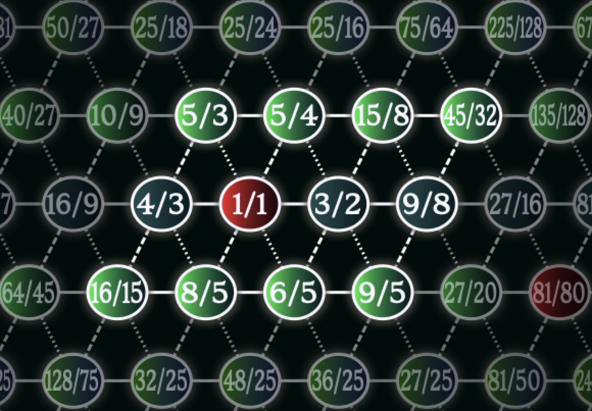

# Lattices: A JI MTS Source

The code in this repo builds a microtonal control plugin which makes extended Just Intonation easy to explore on regular 12-note interfaces. A baseline was put down by BaconPaul in early 2023, which I (Andreya) have been building on in the second half of 2024. It is currently in Alpha. More on that below.



Lattices works by tuning nearby synths to Just Intonation by acting as an **MTS-ESP source** (for more info on what that means, [click here](https://surge-synthesizer.github.io/tuning-guide/#mts-esp)), and displaying a **lattice pattern** that helps navigate the harmonic possibilities. 

These lattice graphics have been used (drawn in slightly different ways) by lots of folks over the years. My most direct inspiration comes from W.A. Mathieu's wonderful book [Harmonic Experience](https://www.innertraditions.com/books/harmonic-experience) (Thanks Allaudin!), and the wonderful work of [Gary Garett](https://www.youtube.com/watch?v=jA1C9VFqJKo) (thanks Gary!). 

Compared to most other MTS-ESP sources (listed in the link above), this one is very limited in scope. It has one particular purpose which it aims to excel at. Non-12-note scales and non-octave scales (while wonderful in their own way) are out of scope here. That, plus a few other specific assumptions, allows us to navigate a theoretically infinite set of pitches with a fairly simple set of controls. 

## Using

I recommend using it with a regular ordinary MIDI keyboard, plus any MIDI controller that has at least 5 buttons capable of sending momentary CC messages. I've been using a Launchpad Mini while developing it, but anything goes really. 

Load Lattices in your DAW, alongside some compatible instrument of your choice. Many are listed in the link above. If you don't have any, I recommend [Surge](https://surge-synthesizer.github.io/).

By default, Lattices will tune your synths to a Just Intonation scale known in many places in the world under different names, but which I'm calling [Duodene]( http://www.tonalsoft.com/enc/d/duodene.aspx). 
The graphic you see represents the infinite pitch space of (5-limit) Just Intonation. The red sphere reading 1/1, represents the tonic (C, by default). Horizontal neighbors are a fifth apart, diagonally up-right is always a major third up, down-right a minor third up. (Octave-reduced... blablablabla, this text will be improved eventually)

You should see a pattern of twelve spheres near the middle which are lit up (while the rest are dimmed). That's the 12-note (octave-repeating) Duodene scale which currently will be sent to your synths. If you've never played in it before, you can quickly discover the (subjective) upside and downside it has over the common 12-equal tuning: Play a C major chord followed by a Bb major chord. Assuming everything has loaded and connected correctly, the C should sound extremely stable and the Bb should sound distinctly challenged. 

Send Lattices a momentary trigger message (max value for a short moment) at MIDI CC 7 on channel 1. The lit-up section on the lattice should move one step to the east. Now the Bb chord will sound stable! :) 

Some other chord will now sound out-of-tune instead, but that's ok! The point is, in anticipation of a sour chord, we can shift the mapping around. This way we can make perfectly in-tune 5-limit music, in any key we want, modulating to any key we want. Even though this requires more than 12 notes per octave, we will be able to do this easily using common 12-note tools. This invites new ways to explore harmony. Etc etc blablabla. More to come. :) 

Other usage notes: 

-  The Settings tab at the top has controls to select which note is the 1/1, and which frequency it should have. (Changing root note also sets the frequency to that currently held by that note). 
-   It also has a mode switch which requires some more explanation... will get to it eventually.
-   The "Home CC" field (5 by default) lets you choose which CCs trigger the tuning changes. "Home" here means "return to where we started". The next 4 CCs after the one you chose (6-9 by default) will step west, east, north and south respectively. The next ones after that activate/deactivate the "visitors".
-   "Visitors"? It is a feature which lets you temporarily invite higher-limit intervals onto the 5-limit 2d lattice (and to the keyboard). You define groups of such visitors in the menu top left. Then you use the aforementioned MIDI CCs to invite/uninvite them. 
-   The MIDI CC control works well for live playing. But for a DAW arrangement it's inconvenient cause it won't recall the tuning when you skip around the timeline. For that purpose the lattice position and visitor status are exposed as parameters. I typically experiment using the CCs and when I have an idea, record/program the shifts as automation.


## Lattices is currently in Alpha. 
Here's what that means in this case: 

- The overall design is pretty finished, but most features are still very half-baked. 
- The process of baking them is still pretty volatile! Stuff is subject to change (though features won't be removed).
- Streaming stability is a definite maybe. This is not as dangerous with an MTS-ESP plug as with a synth (and no current features will be outright removed), but still, know that stuff will change and loading an old project with a new version may not work.
- Many planned features are missing. The issue list here has the planned features mostly sketched out. Check that before making feature requests (feature requests are welcome though). 


## Building

This works on Mac and Linux and probably Windows. If you just wanna use it you can grab a nightly build from releases.

```
git clone https://github.com/Andreya-Autumn/lattices.git
cd lattices
git submodule update --init --recursive
cmake -Bignore/build -DCMAKE_BUILD_TYPE=RELEASE
cmake --build ignore/build
```

## Contributing

Contributions welcome! The best ways to get in touch is to look up the tuning channel in the Surge Synth Team Discord and ping Andreya there. Otherwise make an issue or PR on Github.

## Licensing

This is MIT licensed but if you use the GPL3 juce as opposed to a licensed juce to distribute it
the combined work is distributed under GPL3.

